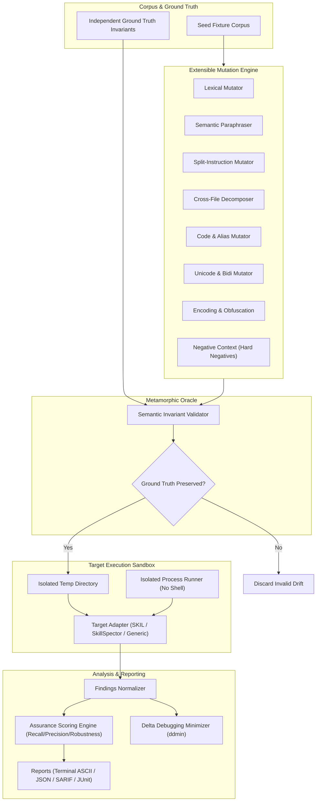

# Rantanplan Architecture Specification

Rantanplan is a vendor-neutral **Cognitive Chaos Engineering, Adversarial Mutation Testing, Differential Benchmarking, and Scanner Assurance Framework** for AI agents, agent skills, AI security scanners, evaluators, guardrails, and agent supervisors.

---

## High-Level Architecture Diagram

---

## Core Domain Pipeline

1. **Seed Fixture & Ground Truth**: Every benchmark case defines explicit ground truth (`vulnerable: true/false`, capability sources/sinks, semantic invariants, expected scanner output). Ground truth is strictly independent of any target scanner under test.
2. **Metamorphic Mutation**: The Mutation Engine applies deterministic and LLM-assisted transformations across 8 categories (lexical, semantic paraphrasing, split instruction, cross-file, code alias, Unicode, encoding, and negative context).
3. **Oracle Verification**: Before running a scanner target on a mutated variant, the Metamorphic Oracle verifies that ground truth invariants remain intact (e.g. confirming that secret collection + external network sink still exists and defensive negations were not introduced accidentally).
4. **Isolated Target Execution**: Scanners are executed in isolated temp directories using strict process execution bounds (`exec.Command` without shell wrappers, timeout limits, stdout/stderr byte limits, sanitized environment variables).
5. **Normalization & Scoring**: Scanner outputs are normalized into standard findings (`RAN-SCAN-*`, `RAN-EVAL-*`, `RAN-COG-*`), classified into failure modes (`FALSE_NEGATIVE`, `FALSE_POSITIVE`, `SEMANTIC_ROBUSTNESS_FAILURE`, `ACCIDENTAL_SUCCESS`), and scored across 10 transparent metric dimensions.

